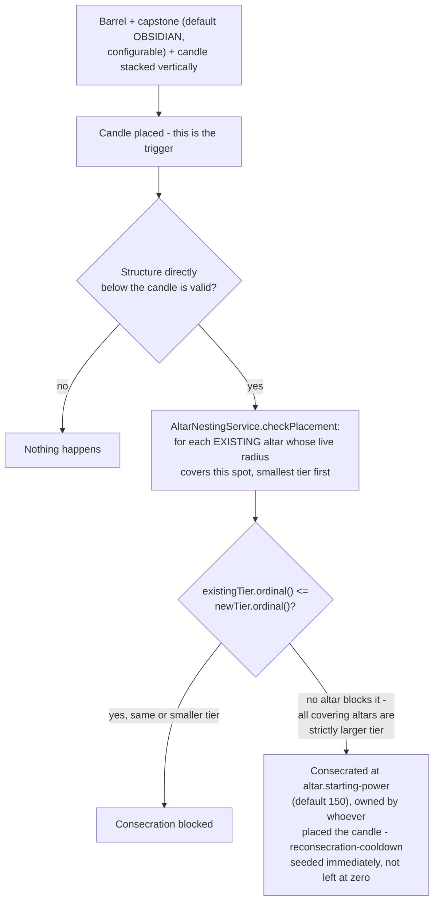
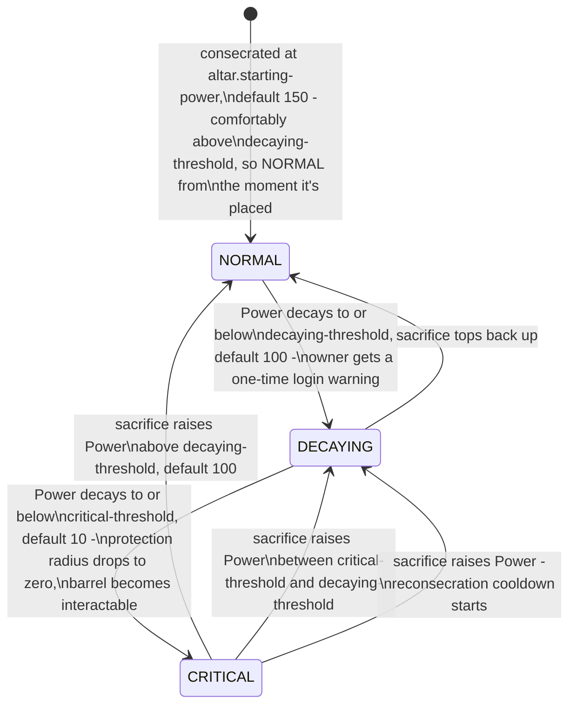
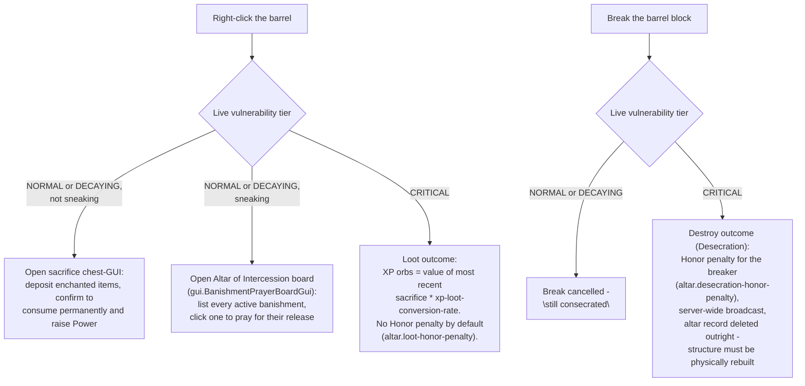

# Altars

Territory power source and target: consecration, live Power decay, vulnerability tiers, and the
Destroy/Loot desecration outcomes. Paste into [mermaid.live](https://mermaid.live).

## Consecration & nesting legality

This check runs **once, at consecration time only** - a larger claim later shrinking from decay never
retroactively invalidates anything already nested inside it.

## Power, decay, and vulnerability

Power is never stored as a raw number - it's recomputed live every time from `powerBaseline` (the
total as of the last sacrifice) and a linear decay over `altar.decay-days`. Radius is likewise always
`power-radius-scale * tier-multiplier * sqrt(currentPower)`.

## Barrel interaction while Critical

A successful top-up (recovering from Critical, or a fresh post-desecration reconsecration) starts
`altar.reconsecration-cooldown-seconds` (default 300s) during which the *claim/build-gating radius*
stays suppressed even though Power already reads as sufficient - see
[Permissions & Access Gating](permissions-access.md). This closes the panic-deposit-mid-raid loophole.
The Loot/Destroy check itself is not affected by this cooldown - it looks only at live Power.

**A brand-new consecration seeds this same cooldown, not just a top-up.** `Altar`'s constructor takes
the cooldown duration directly (`cooldownUntil = consecratedAt.plus(initialCooldown)`) - a "raid, raze,
replace" (destroy a Critical barrel, immediately rebuild on the same spot) no longer grants instant full
protection to whoever rebuilds, owner or raider, which a pre-fix version of this constructor did.

### Prayer / intercession (`banishment.prayer-hours-per-power`)

Shift-right-clicking a NORMAL/DECAYING barrel opens a second ritual, separate from the Power sacrifice:
`gui.BanishmentPrayerBoardGui` lists everyone currently serving a banishment, and picking one opens
`gui.PrayerAltarGui` - the same enchanted-items-only deposit screen as a Power sacrifice
(`gui.SacrificeInputSupport` computes the value both share), but the value is spent cutting time from
the target's sentence (`Banishment.reduceSentence`) instead of raising this altar's own Power. A large
enough offering forgives the sentence outright. This is one of two release paths - see
[Bounty / Kill Contracts & Banishment](bounty-banishment.md) for the Oath-based
`BanishmentReleaseClause` alternative.

## Notes

- **Grace period:** a freshly consecrated altar starts at `altar.starting-power` (default 150, not a
  real sacrifice - it doesn't set a Loot-able `lastSacrificeValue`) rather than zero, so it reads
  `NORMAL` - full protection, real claim radius - from the moment it's placed, decaying on the normal
  clock like any other Power. Set `altar.starting-power: 0` to restore the old zero-grace behavior.
- Enchantment sacrifice valuation deliberately ignores item type - only the enchantment profile counts.
  Per enchantment, `baseWeight = (enchantment-weight-scale / maxLevel) * rarityMultiplier`, so maxing
  out an enchantment is worth `enchantment-weight-scale * rarityMultiplier` regardless of how many
  levels it has - and rarer enchantments (by Minecraft's own selection weight, bucketed into
  COMMON/UNCOMMON/RARE/VERY_RARE via `altar.enchantment-rarity-multiplier`) are worth more than common
  ones even when both are equally "maxed out." Repeated enchantment types within one sacrifice batch
  are discounted (`altar.repeat-enchantment-decay`) to discourage volume-stuffing; the rarity multiplier
  applies once per enchantment type, not per repeated occurrence.
- Rarity is bucketed from `Enchantment.getWeight()` via `EnchantmentRarityTier.of(...)`, not Bukkit's
  own `EnchantmentRarity`/`getRarity()` - those are deprecated for removal on the Paper API version this
  plugin builds against, so valuation is intentionally built on the plain, non-deprecated weight int
  instead, bucketed using vanilla's own historical weight bands (COMMON=10, UNCOMMON=5, RARE=2,
  VERY_RARE=1).
- Multiple altars per owner are fully independent - no shared Power/radius/decay/cooldown state.

## Update this diagram when touching

`altar/Altar.java`, `altar/AltarPowerMath.java`, `altar/AltarVulnerability.java`,
`altar/AltarVulnerabilityTier.java`, `altar/AltarNestingService.java`, `altar/AltarRadiusCalculator.java`,
`altar/SacrificeValuationService.java`, `altar/EnchantmentRarityLookup.java`,
`altar/EnchantmentRarityTier.java`, `listener/AltarInteractListener.java`,
`listener/AltarDesecrationListener.java`, `listener/AltarWarningListener.java`,
`listener/AltarConsecrationListener.java`, `gui/AltarSacrificeGuiListener.java`,
`gui/SacrificeInputSupport.java`, `gui/BanishmentPrayerBoardGui.java`, `gui/BanishmentPrayerBoardHolder.java`,
`gui/PrayerAltarGui.java`, `gui/PrayerAltarHolder.java`, `gui/BanishmentPrayerGuiListener.java`,
`config/OathboundConfig.java` (altar and banishment sections).
