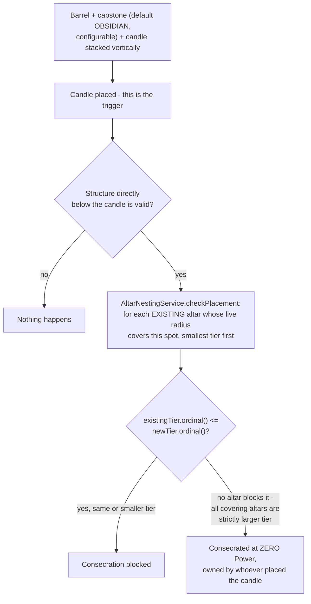
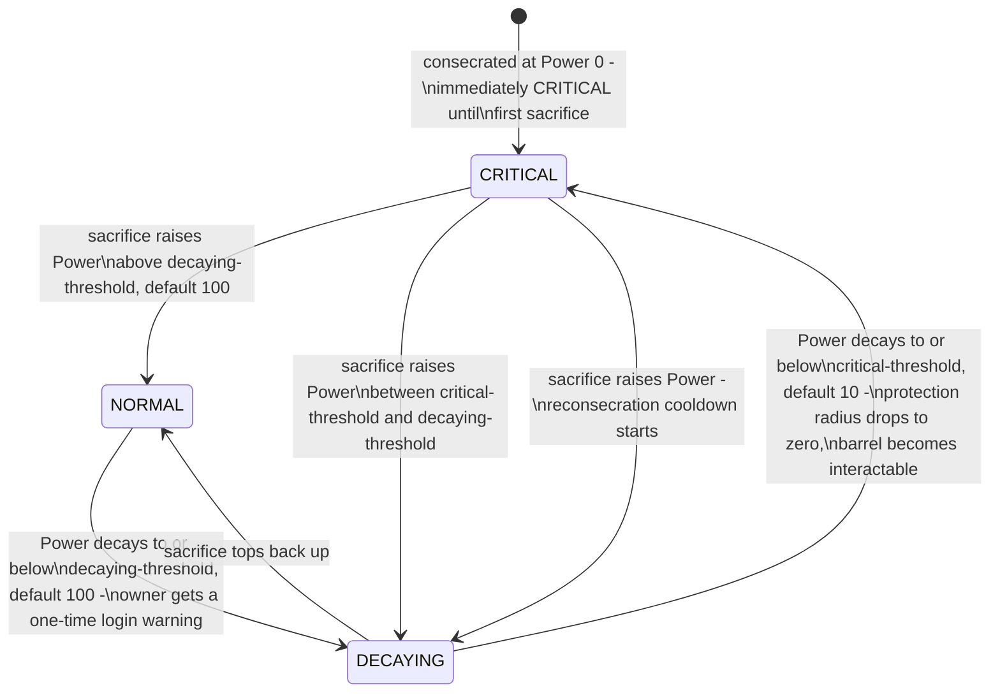
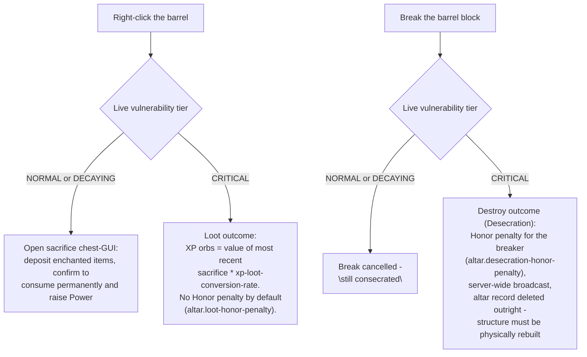

# Altars

Territory power source and target: consecration, live Power decay, vulnerability tiers, and the
Destroy/Loot desecration outcomes. Paste into [mermaid.live](https://mermaid.live).

## Consecration & nesting legality

This check runs **once, at consecration time only** - a larger claim later shrinking from decay never
retroactively invalidates anything already nested inside it.

## Power, decay, and vulnerability

Power is never stored as a raw number - it's recomputed live every time from `powerBaseline` (the
total as of the last sacrifice) and a linear decay over `altar.decay-days`. Radius is likewise always
`power-radius-scale * tier-multiplier * sqrt(currentPower)`.

## Barrel interaction while Critical

A successful top-up (recovering from Critical, or a fresh post-desecration reconsecration) starts
`altar.reconsecration-cooldown-seconds` (default 300s) during which the *claim/build-gating radius*
stays suppressed even though Power already reads as sufficient - see
[Permissions & Access Gating](permissions-access.md). This closes the panic-deposit-mid-raid loophole.
The Loot/Destroy check itself is not affected by this cooldown - it looks only at live Power.

## Notes

- **Non-obvious behavior:** a freshly consecrated altar (Power = 0) is Critical from the instant it
  exists - it has zero claim radius and its barrel is already interactable (Loot only, since Destroy
  requires *breaking* the barrel and nothing stops that either) until someone performs a sacrifice.
  There is no grace period.
- Enchantment sacrifice valuation deliberately ignores item type - only the enchantment profile counts,
  and repeated enchantment types within one sacrifice batch are discounted
  (`altar.repeat-enchantment-decay`) to discourage volume-stuffing.
- Multiple altars per owner are fully independent - no shared Power/radius/decay/cooldown state.

## Update this diagram when touching

`altar/Altar.java`, `altar/AltarPowerMath.java`, `altar/AltarVulnerability.java`,
`altar/AltarVulnerabilityTier.java`, `altar/AltarNestingService.java`, `altar/AltarRadiusCalculator.java`,
`altar/SacrificeValuationService.java`, `listener/AltarInteractListener.java`,
`listener/AltarDesecrationListener.java`, `listener/AltarWarningListener.java`.
