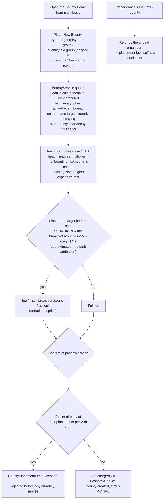
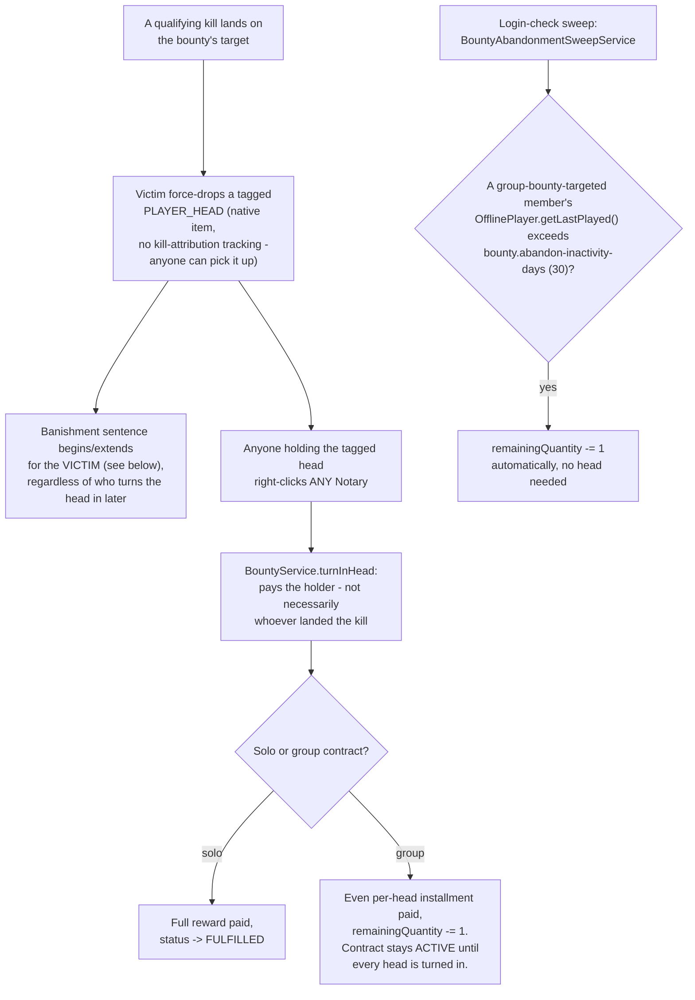
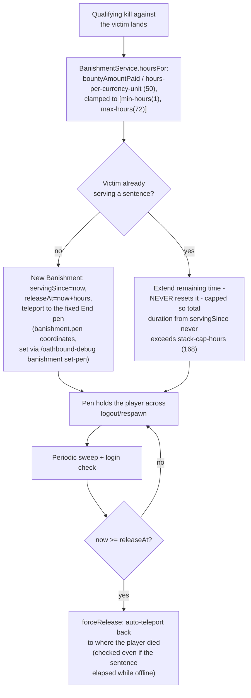
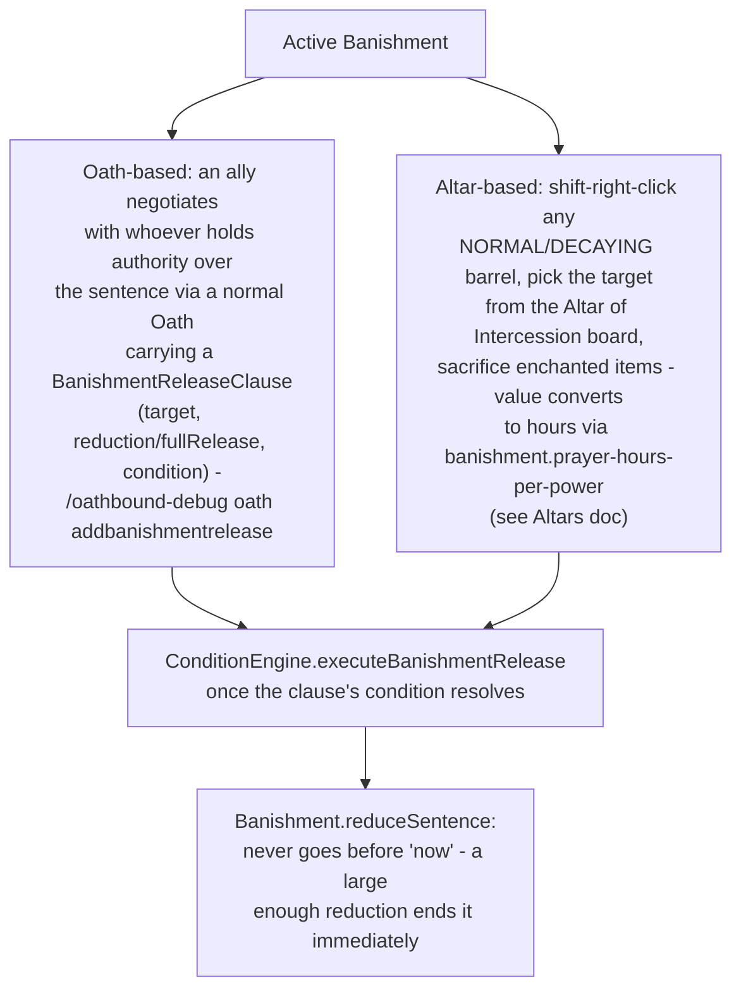
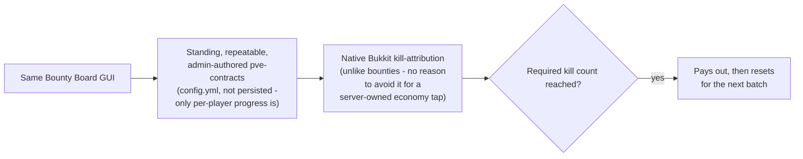

# Bounty / Kill Contracts & Banishment

Bounties are placed **unilaterally** - the target never consents - so they're deliberately not built
on `Oath`/`ConditionEngine` at all. A separate `bounty` package (`BountyService`/`BanishmentService`)
handles placement, fulfillment, and the End-pen sentence. Paste into
[mermaid.live](https://mermaid.live).

## Placement

## Fulfillment

## Banishment

## Release paths

A sentence is no longer a pure fire-and-forget timer - two independent ways to shorten or forgive one
exist, both driving the same `Banishment.reduceSentence` seam:

The release oath reuses the normal propose/seal handshake for consent (the placer has to actually agree
to the terms of whatever the ally offers), same as a `DiplomacyClause` treaty; the prayer ritual needs no
one's consent at all, just a big enough sacrifice - the two are deliberately different in that respect,
mirroring how a treaty requires mutual agreement but a sacrifice at an altar doesn't.

## PvE contracts (separate, no attribution problem)

## Notes

- A one-time login notice tells a player they have a bounty the first time they log in after it's
  placed (not every login); `/oathbound-bounty list [player]` is the always-available pull, and
  `/oathbound-bounty notify off` opts out of the notice entirely.
- Heat and Power (Altars) share the same design pattern deliberately: never persisted, always
  recomputed live from history + a decay window.

## Update this diagram when touching

`bounty/Bounty.java`, `bounty/BountyService.java`, `bounty/HeatCalculator.java`,
`bounty/BountyTargeting.java`, `bounty/Banishment.java`, `bounty/BanishmentService.java`,
`bounty/BanishmentSweepService.java`, `bounty/BountyAbandonmentSweepService.java`,
`bounty/PveContractService.java`, `oath/Clause.java` (`BanishmentReleaseClause`),
`oath/ConditionEngine.java` (`executeBanishmentRelease`), `command/OathboundDebugCommand.java`
(`addbanishmentrelease`), `gui/BanishmentPrayerBoardGui.java`, `gui/PrayerAltarGui.java`,
`gui/BanishmentPrayerGuiListener.java`.
