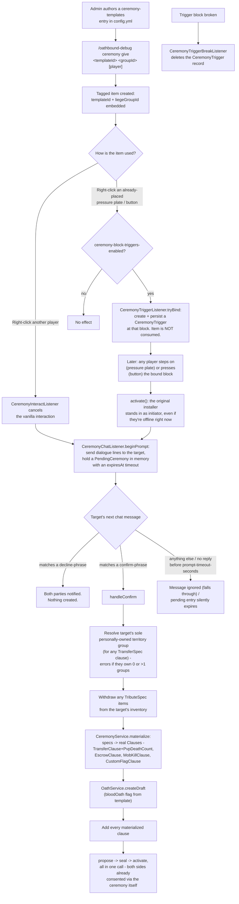

# Ceremony Designer

A templated, item-driven shortcut for binding a group-to-individual agreement with no menus or
commands on the receiving end - just a right-click and a chat reply. Templates are admin-authored,
static config (`ceremony-templates` in `config.yml`; empty by default, so the feature is inert until a
server admin writes at least one). Paste into [mermaid.live](https://mermaid.live).

## Notes

- Ceremonies are purely a **front-end for the Oath system** - every completed ceremony produces and
  immediately seals/activates a real `Oath`, same lifecycle as any other (see
  [Oath Lifecycle](oath-lifecycle.md)), just skipping the usual propose-then-wait gap.
- A template's clause list can include a `DiplomacyClause` (see [Diplomacy](diplomacy.md)) per the
  data model, though no shipped example currently uses one.
- No connection exists to Altars anywhere in the ceremony code.
- **Known gaps:** `ceremony-templates` ships empty, so nothing works until an admin authors YAML. There
  is no admin command to unbind a block trigger short of physically breaking the block, and no
  cooldown/rate-limit on re-triggering a plate beyond the "already has a pending prompt" guard.

## Update this diagram when touching

`ceremony/*.java`, `listener/CeremonyInteractListener.java`, `listener/CeremonyChatListener.java`,
`listener/CeremonyTriggerListener.java`, `listener/CeremonyTriggerBreakListener.java`,
`db/migrations/0014_ceremony_triggers.sql`, the `ceremony-templates` config shape.
