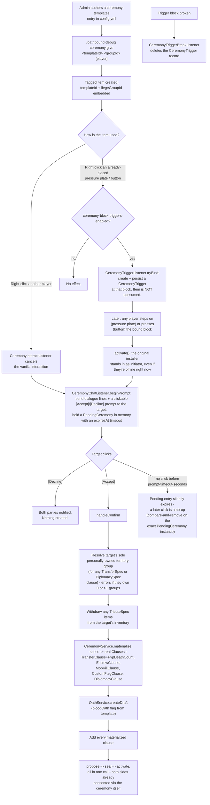

# Ceremony Designer

A templated, item-driven shortcut for binding a group-to-individual agreement with no menus or
commands on the receiving end - just a right-click and a clickable chat prompt. Templates are
admin-authored, static config (`ceremony-templates` in `config.yml`; ships with one live default,
`welcome-pact` - a zero-mechanical-stakes onboarding pledge, safe to hand out without review). Paste
into [mermaid.live](https://mermaid.live).

## Notes

- Ceremonies are purely a **front-end for the Oath system** - every completed ceremony produces and
  immediately seals/activates a real `Oath`, same lifecycle as any other (see
  [Oath Lifecycle](oath-lifecycle.md)), just skipping the usual propose-then-wait gap.
- A template's clause list can include a `DiplomacySpec` (see [Diplomacy](diplomacy.md)), materialized
  into a `DiplomacyClause` between the liege group and the target's own resolved territory group - the
  commented-out `fealty` *example* in `config.yml` (not shipped active, unlike `welcome-pact` below)
  uses one (`state: alliance`) to seal an alliance between the Crown and the sworn vassal's own kingdom
  in the same ceremony that transfers land and collects tribute. `state: neutral` is rejected - there's
  nothing to "declare" back to it (same restriction as the unilateral/treaty diplomacy paths).
- `CeremonyService.materialize` enforces the same "only REGION/KINGDOM-tier root groups may hold a
  relation" rule the debug diplomacy commands enforce, resolved via `OwnershipResolver.resolveRootGroup`
  on both the liege group and the target's resolved territory group - a ceremony can't quietly create a
  relation on a bare Individual-tier group the way the raw domain model would otherwise allow. Sealing
  fails with a `CeremonyValidationException` (shown to both parties, oath not created) if either side's
  root isn't REGION/KINGDOM tier.
- No connection exists to Altars anywhere in the ceremony code (the altar-based banishment prayer
  ritual is a separate feature reachable from the barrel itself - see [Altars](altar.md)).
- **Confirmation is click-based, not free text.** An earlier version matched the target's next chat
  message against configured `confirm-phrases`/`decline-phrases` strings - a real gap, since an
  unrelated message that happened to equal one (a bare "yes" answering someone else's question,
  arriving while a prompt happened to be pending) could accidentally seal a real oath the target never
  meant to answer. `CeremonyTemplateDefinition` no longer has phrase fields to author at all; the prompt
  is always a `ClickEvent.callback`-backed [Accept]/[Decline] pair, so nothing but an actual click on
  that specific rendered prompt can resolve it (`pending.remove(targetId, ceremony)` is a
  compare-and-remove keyed on the exact `PendingCeremony` instance, so a stale/replayed button - already
  answered, or superseded by a newer prompt - is a no-op).
- **Real-stakes templates are visually flagged before anyone commits.**
  `CeremonyTemplateDefinition.hasRealStakes()` (any clause beyond a `CustomFlagSpec`) drives two
  independent warnings: `bukkit.CeremonyItems` gives the item an enchant-glint shimmer and an explicit
  lore warning, and `OathboundPlugin.ambientCeremonyTriggerParticles` spawns an ongoing particle aura at
  any *bound trigger block* with real stakes - the latter matters because someone who steps on a rigged
  pressure plate never held the item at all, so an item-only warning wouldn't have reached them.
  `welcome-pact` gets neither, since it has none.
- **Shipped default:** `welcome-pact` (`PAPER`/"Charter of Welcome") has zero mechanical stakes - just
  a `CustomFlagSpec` RP pledge, no transfer/tribute/escrow/diplomacy clause - specifically so an admin
  can hand it to a new player via `/oathbound-debug ceremony give welcome-pact <groupId> [player]`
  without reviewing it first. Edit or delete it like any other config entry.
- **Known gaps:** no admin command to unbind a block trigger short of physically breaking the block,
  and no cooldown/rate-limit on re-triggering a plate beyond the "already has a pending prompt" guard.

## Update this diagram when touching

`ceremony/*.java`, `listener/CeremonyInteractListener.java`, `listener/CeremonyChatListener.java`,
`listener/CeremonyTriggerListener.java`, `listener/CeremonyTriggerBreakListener.java`,
`bukkit/CeremonyItems.java`, `OathboundPlugin.java` (`ambientCeremonyTriggerParticles`),
`db/migrations/0014_ceremony_triggers.sql`, `config/OathboundConfig.java`
(`parseCeremonyTemplates`/`parseCeremonyClauses`), the `ceremony-templates` config shape,
`group/OwnershipResolver.java` (`resolveRootGroup`, used by the diplomacy tier check).
