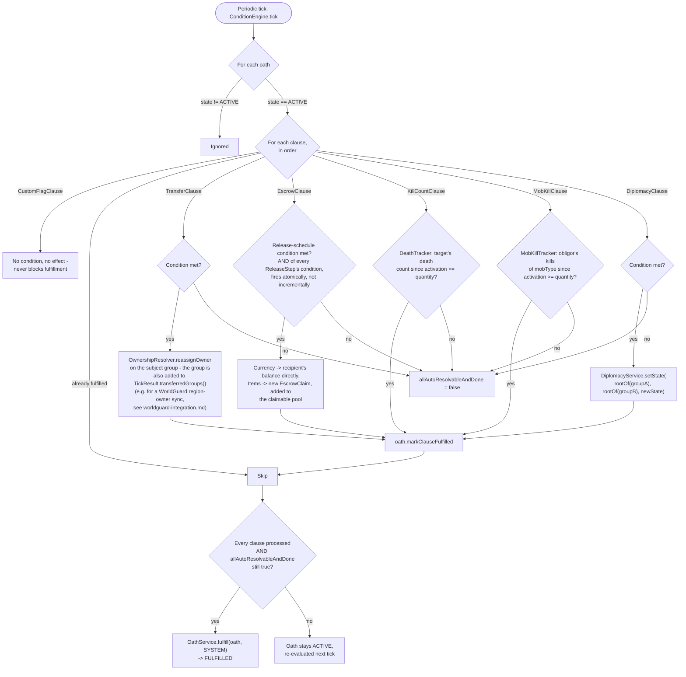
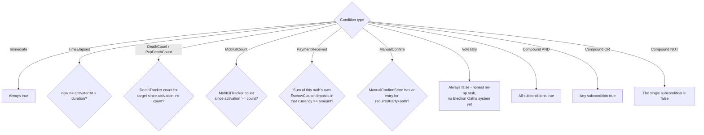

# Condition Engine

A periodic tick (`ConditionEngine.tick`) walks every `ACTIVE` oath and turns each *met* condition into
its real effect - this is what separates "the engine can tell you a condition would be true" from
"the engine actually did something about it." Paste into [mermaid.live](https://mermaid.live).

Condition evaluation itself (`ConditionEvaluator`) is a small recursive tree over
`Condition`'s sealed variants:

## Notes

- `KillCountClause` and `MobKillClause` have **no execution side effect of their own** - resolving the
  condition *is* fulfilling the clause (unlike Transfer/Escrow/Diplomacy, which do something on top of
  the condition becoming true).
- A clause type the engine doesn't recognize (there currently isn't one, but the `switch` has a
  `default -> false`) permanently blocks auto-fulfillment - the oath just sits `ACTIVE` forever unless
  someone force-resolves it via `/oathbound-debug oath fulfill|breach`.
- `PaymentReceived` only sees **this oath's own** escrow deposits, so a same-oath `TransferClause` can
  gate on its own `EscrowClause` having been paid in.
- Legacy/rehydrated oaths with no `activatedAt` timestamp are skipped entirely (nothing safe to
  evaluate a duration/count against).

## Update this diagram when touching

`ConditionEngine.java`, `ConditionEvaluator.java`, `Condition.java`, `Clause.java`,
`DomainConditionContext.java`, `DeathTracker.java`, `MobKillTracker.java`, `ManualConfirmStore.java`.
