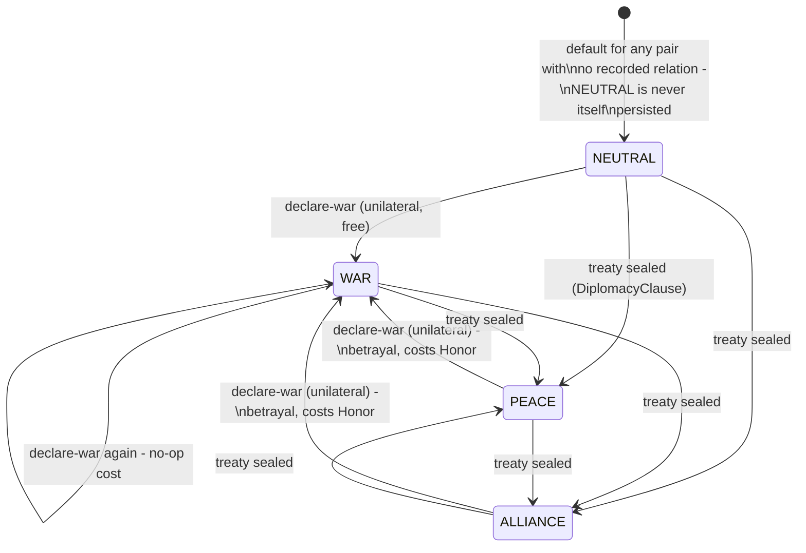
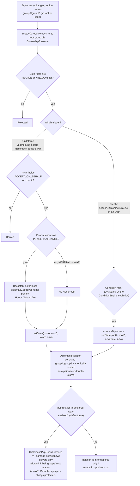

# Diplomacy

A `DiplomaticRelation` exists only between two **root** `ProtectionGroup`s (a group not owned by any
other group) - a vassal's diplomatic standing is always its liege's, resolved live via
`OwnershipResolver.resolveRootGroup` (see [Groups & Ownership](groups-ownership.md)). Only `REGION` and
`KINGDOM`-tier root groups may hold a relation at all. Paste into [mermaid.live](https://mermaid.live).

## States

`DiplomacyService.setState` itself has no state-machine restriction - any state can be set to any
other; the "betrayal" cost above is a side effect applied only by the unilateral war-declaration path,
not a hard block.

## Triggers, authority, and side effects

## Notes

- A treaty (via `DiplomacyClause`) requires mutual consent because it rides on the normal Oath
  propose/seal handshake - both signatories have to sign before the clause can ever execute.
  Declaring war does not require the other side's consent at all.
- `NEUTRAL` cannot be set via a treaty clause - it's purely the implicit default for an unrecorded
  pair.
- **Known limitation:** PvP restriction is currently the *only* mechanical consequence of a relation - no
  build/claim interaction and no automatic Oath-Board posting exists yet for a diplomacy change.

## Update this diagram when touching

`diplomacy/DiplomaticState.java`, `diplomacy/DiplomaticRelation.java`, `diplomacy/DiplomacyService.java`,
`oath/Clause.java` (`DiplomacyClause`), `oath/ConditionEngine.java` (`executeDiplomacy`),
`listener/DiplomaticPvpGuardListener.java`, `command/OathboundDebugCommand.java` (diplomacy subcommands).
