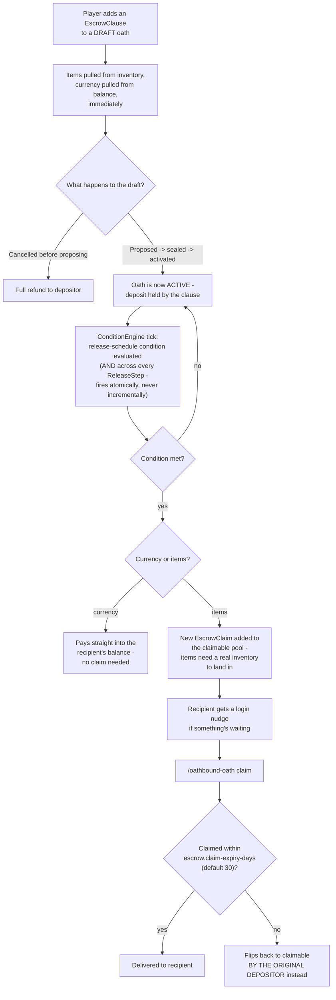

# Escrow

`EscrowClause` deposits are pulled from the depositor the moment the clause is added - not on sealing,
not on release - and currency vs. items take genuinely different paths afterward. Paste into
[mermaid.live](https://mermaid.live).

## Notes

- **Only unclaimed items expire** - a currency release is final and instant, since a balance isn't a
  delivery problem the way an inventory slot is.
- **Not implemented:** escheat-to-Notary and breach-split abandonment policies from the master plan -
  "return to depositor" is the only unclaimed-item policy today, since neither a Notary escheat system
  nor a breach-split system exists yet.
- Escrow release also feeds [Honor](honor.md) indirectly: `OathSeverity` counts escrowed currency
  toward an oath's stakes, scaling how much Honor moves on `FULFILLED`/`BROKEN`.

## Update this diagram when touching

`oath/Clause.java` (`EscrowClause`, `ReleaseStep`), `oath/EscrowClaim.java`,
`oath/EscrowExpiryService.java`, `oath/ConditionEngine.java` (`executeEscrowRelease`).
