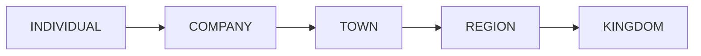
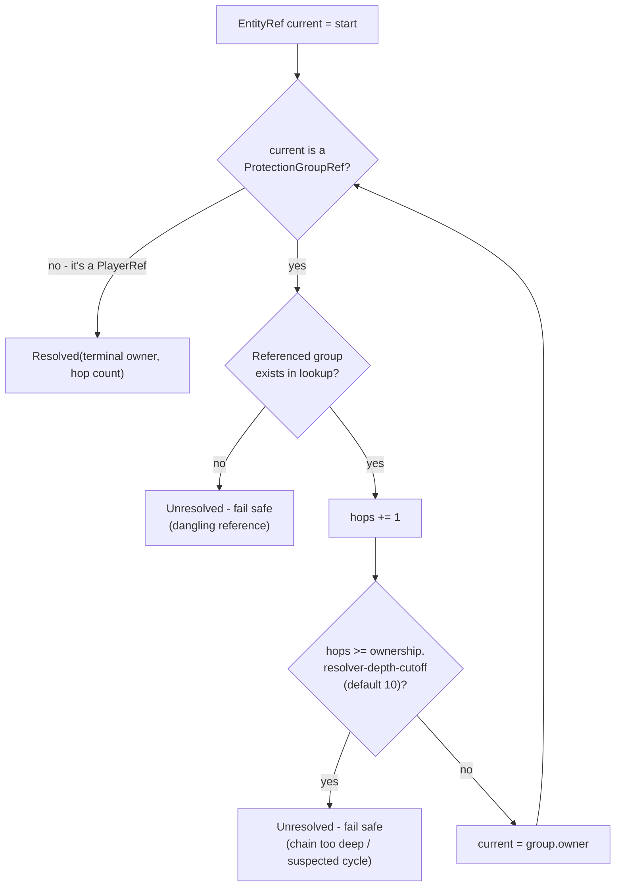
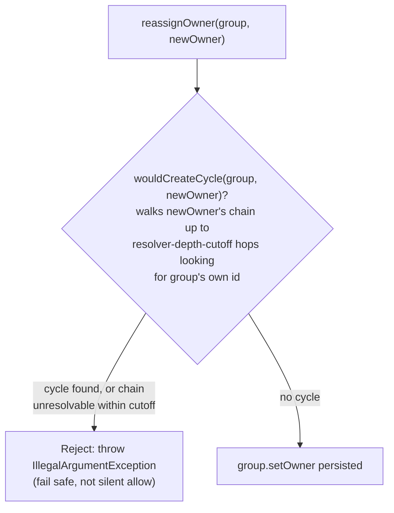
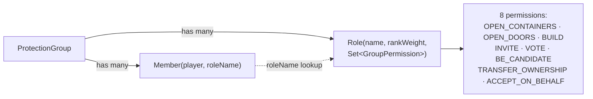

# Groups & Ownership

Every claim, faction, company, or kingdom is a `ProtectionGroup`. Its `owner` field is an `EntityRef` -
either a specific player (`PlayerRef`) or *another group* (`ProtectionGroupRef`) - which is how a
company can belong to a town, a town to a region, and so on. Paste into
[mermaid.live](https://mermaid.live).

## Tier hierarchy

`GroupTier` ordinal order drives tier-sensitive decisions elsewhere in the plugin - e.g. Diplomacy
restricting relations to REGION/KINGDOM-tier roots (see [Diplomacy](diplomacy.md)):

## Resolving who ultimately owns something

`OwnershipResolver.resolveTerminalOwner` walks the `owner` chain live, on every read - nothing about
the resolved owner is cached or stored:

`resolveRootGroup` is the same walk restricted to group-owned-by-group links, used by
[Diplomacy](diplomacy.md) to find "the most senior group in the chain" that actually holds relations.

## Changing ownership safely

`OwnershipResolver.reassignOwner` is the **only sanctioned way** to mutate a group's `owner` -
`ProtectionGroup.setOwner` is package-private specifically to force every write through this check:

This is also the exact mechanism `ConditionEngine` uses to execute a `TransferClause` (see
[Condition Engine](condition-engine.md)) and what `/oathbound-debug group transfer` calls directly.

## Membership & permissions

`ProtectionGroup.hasPermission(player, permission)` finds the player's `Member`, resolves their `Role`
by name, and checks membership in that role's permission set - defaulting to `false` (deny) if either
lookup fails.

`BUILD` currently has one real consumer: it's the convention [WorldGuard Integration](worldguard-integration.md)
uses to decide which of a linked group's members get pushed as a WorldGuard region's owners - not enforced
in code beyond that sync (WorldGuard's own region flags are the actual gate), just the source-of-truth
membership list.

## Notes

- **Group creation:** `/oathbound-group create <name> [tier]` is the player-facing entry point -
  `command/OathboundGroupCommand.createGroup` makes the creator an "Owner" role holding every permission
  and is the only code path anywhere that constructs a `ProtectionGroup` (the `/oathbound-debug group
  create` debug equivalent calls the same shared method, kept for admin/testing scripting). Gating the
  entire `/oathbound-debug` surface behind the `oathbound.debug` permission (see [README](../README.md)'s
  Debug commands section) would otherwise have left non-admins with no way to found a group, or lock a
  single chest, at all - this command exists specifically so that isn't the case. The same command also
  handles `link-region` (requires `TRANSFER_OWNERSHIP`) - see [WorldGuard Integration](worldguard-integration.md).
- **Known gap:** there is still no in-game GUI or command for inviting members, assigning roles, or
  editing a role's permission set after creation - a group has exactly one member (its founder) for now,
  regardless of which command created it.
- Cycle-safety is enforced **at write time only** - a plain read never re-validates an already-stored
  chain.

## Update this diagram when touching

`group/ProtectionGroup.java`, `group/GroupTier.java`, `group/GroupPermission.java`, `group/Role.java`,
`group/Member.java`, `group/EntityRef.java`, `group/OwnershipResolver.java`,
`command/OathboundGroupCommand.java`, `command/OathboundDebugCommand.java` (`groupCreate`/`groupTransfer`/etc.).
