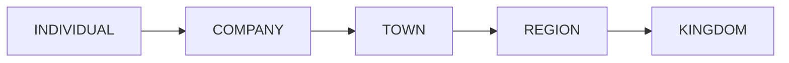
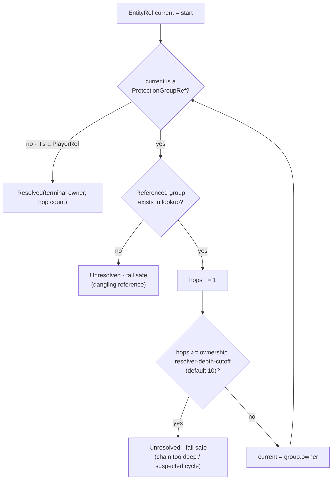
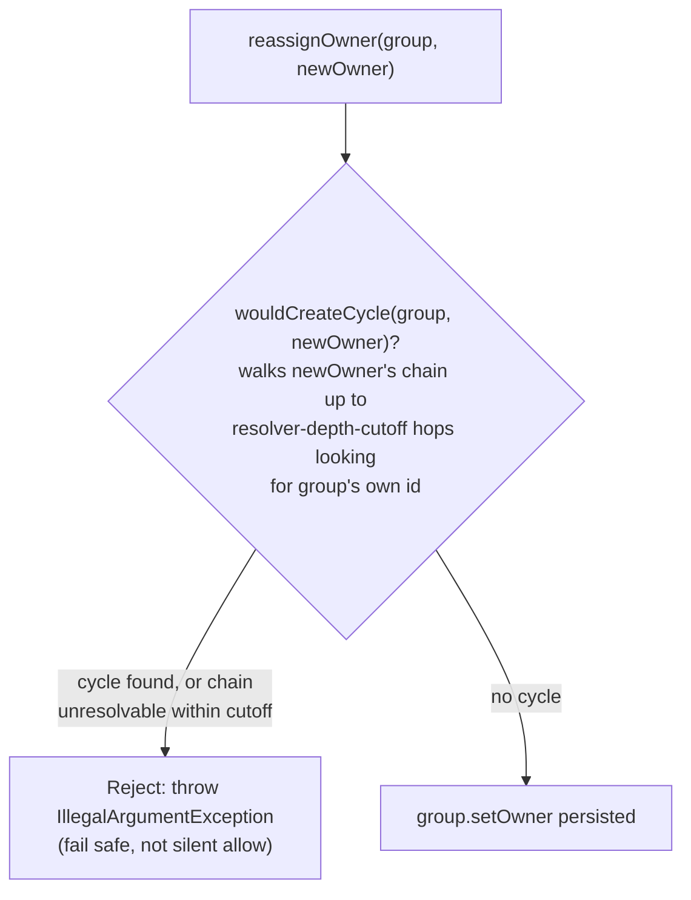
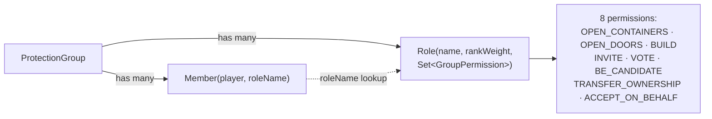

# Groups & Ownership

Every claim, faction, company, or kingdom is a `ProtectionGroup`. Its `owner` field is an `EntityRef` -
either a specific player (`PlayerRef`) or *another group* (`ProtectionGroupRef`) - which is how a
company can belong to a town, a town to a region, and so on. Paste into
[mermaid.live](https://mermaid.live).

## Tier hierarchy

`GroupTier` ordinal order drives every nesting/tie-break decision in the plugin (altar claim overlap,
new-altar nesting legality):

## Resolving who ultimately owns something

`OwnershipResolver.resolveTerminalOwner` walks the `owner` chain live, on every read - nothing about
the resolved owner is cached or stored:

`resolveRootGroup` is the same walk restricted to group-owned-by-group links, used by
[Diplomacy](diplomacy.md) to find "the most senior group in the chain" that actually holds relations.

## Changing ownership safely

`OwnershipResolver.reassignOwner` is the **only sanctioned way** to mutate a group's `owner` -
`ProtectionGroup.setOwner` is package-private specifically to force every write through this check:

This is also the exact mechanism `ConditionEngine` uses to execute a `TransferClause` (see
[Condition Engine](condition-engine.md)) and what `/oathbound-debug group transfer` calls directly.

## Membership & permissions

`ProtectionGroup.hasPermission(player, permission)` finds the player's `Member`, resolves their `Role`
by name, and checks membership in that role's permission set - defaulting to `false` (deny) if either
lookup fails.

## Notes

- **Known gap:** the only code path that creates groups/roles/members today is
  `/oathbound-debug group create <name> [tier]`, which makes the creator an "Owner" role holding every
  permission. There is no in-game GUI or command yet for inviting members, assigning roles, or editing
  a role's permission set after creation.
- Cycle-safety is enforced **at write time only** - a plain read never re-validates an already-stored
  chain.

## Update this diagram when touching

`group/ProtectionGroup.java`, `group/GroupTier.java`, `group/GroupPermission.java`, `group/Role.java`,
`group/Member.java`, `group/EntityRef.java`, `group/OwnershipResolver.java`.
