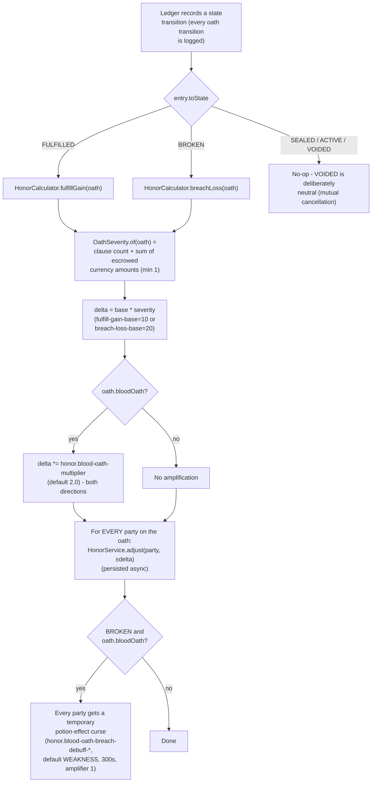
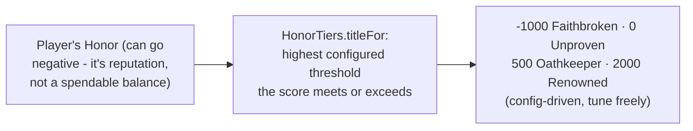
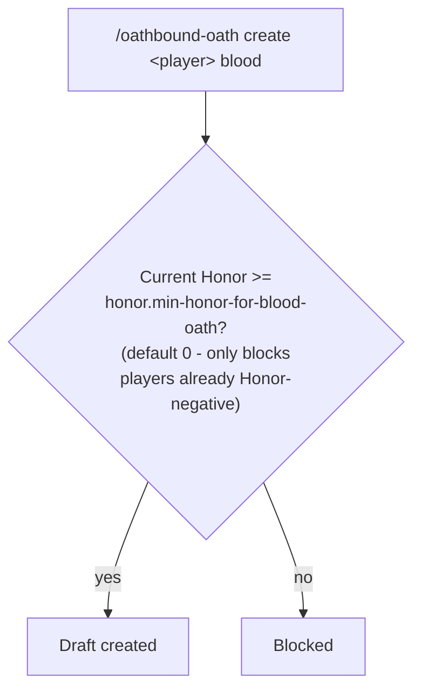

# Honor Scoring

A single global Honor score per player (not per-relationship), moved by `HonorLedgerListener` reacting
to `LedgerEntry` events - a domain-layer listener registered on the `Ledger` itself, not a Bukkit event.
Paste into [mermaid.live](https://mermaid.live).

## Reading a score

## Gating a new Blood Oath

## Notes

- **Known limitation:** the domain model has no fault-attribution concept, so Honor moves apply to
  **every party** of the oath on both `FULFILLED` and `BROKEN` - not just whoever was actually at
  fault. `BROKEN` itself is still only reachable via `/oathbound-debug oath breach` - there's no
  automated "unmet deadline" detection yet.
- Item stakes have no scalar value system yet (the same gap Altar sacrifice valuation solves for
  enchantments), so `OathSeverity` only counts clause count and escrowed *currency* - item-heavy oaths
  under-score relative to their real stakes today.
- Cosmetic titles are display-only via `/oathbound-debug honor info` - no chat-prefix or Oath-Board
  integration exists yet.

## Update this diagram when touching

`honor/HonorService.java`, `honor/HonorCalculator.java`, `honor/OathSeverity.java`,
`honor/HonorTiers.java`, `listener/HonorLedgerListener.java`.
