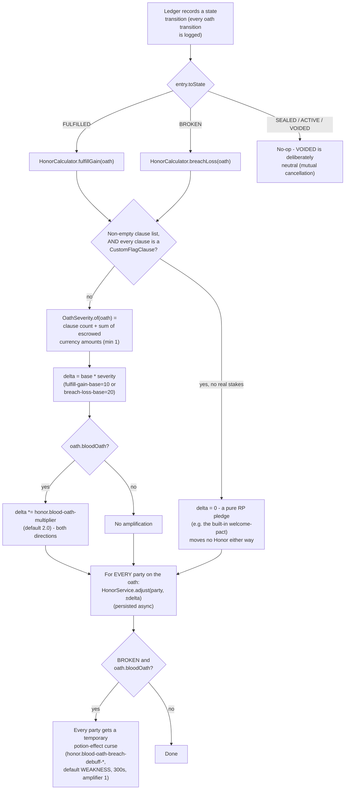
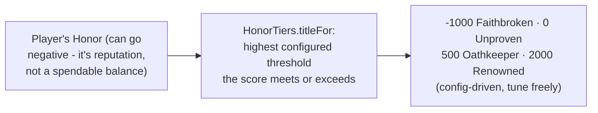
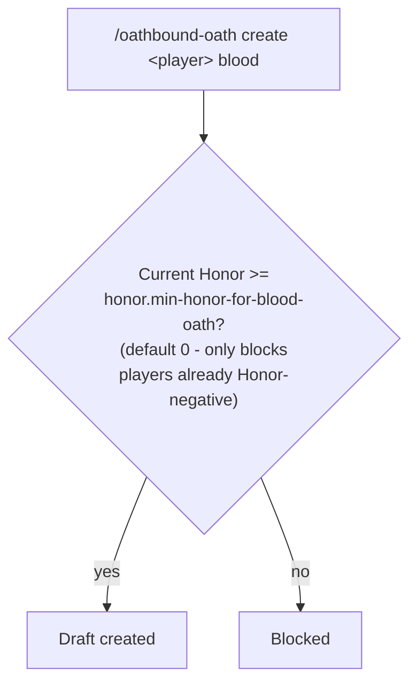

# Honor Scoring

A single global Honor score per player (not per-relationship), moved by `HonorLedgerListener` reacting
to `LedgerEntry` events - a domain-layer listener registered on the `Ledger` itself, not a Bukkit event.
Paste into [mermaid.live](https://mermaid.live).

## Reading a score

## Gating a new Blood Oath

## Notes

- **No-stakes oaths score zero Honor movement.** `HonorCalculator.scale` short-circuits to `delta = 0`
  before computing `OathSeverity` for any oath whose clause list is non-empty but made up entirely of
  `CustomFlagClause`s (a zero-clause oath is unaffected - that's the baseline "not fleshed out yet" case,
  still scored at severity 1). Without this, a zero-stakes oath like the built-in `welcome-pact` ceremony
  minted the full `fulfill-gain-base` for both parties on every use, repeatably and for free - closed by
  this check rather than by delaying `CustomFlagClause`'s (deliberately instant) auto-fulfillment.
- **Known limitation:** the domain model has no fault-attribution concept, so Honor moves apply to
  **every party** of the oath on both `FULFILLED` and `BROKEN` - not just whoever was actually at
  fault. `BROKEN` itself is still only reachable via `/oathbound-debug oath breach` - there's no
  automated "unmet deadline" detection yet.
- Item stakes have no scalar value system yet, so `OathSeverity` only counts clause count and escrowed
  *currency* - item-heavy oaths under-score relative to their real stakes today.
- Cosmetic titles are display-only via `/oathbound-debug honor info` - no chat-prefix or Oath-Board
  integration exists yet.

## Update this diagram when touching

`honor/HonorService.java`, `honor/HonorCalculator.java`, `honor/OathSeverity.java`,
`honor/HonorTiers.java`, `listener/HonorLedgerListener.java`.
