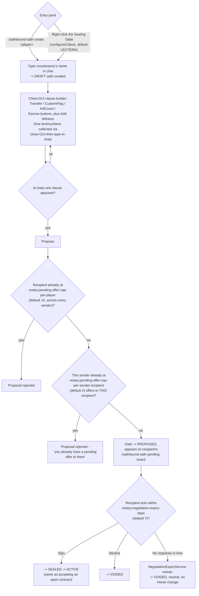
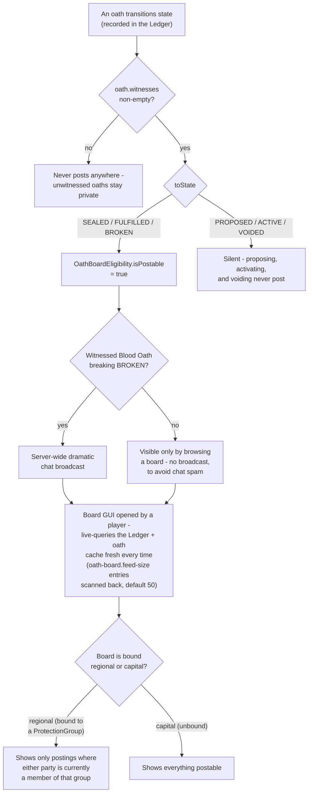

# Named-Party Oath Negotiation & Public Oath Board

How a named-party oath gets drafted and proposed, and how a witnessed oath becomes visible to other
players. Paste into [mermaid.live](https://mermaid.live).

## Drafting and proposing

There's no dedicated "Notary NPC" anymore - `/oathbound-oath create`/`pending`/`claim` and the Sealing
Table block are the only entry points; every installable villager (`/oathbound-<role> install`) is a
standard vanilla trade NPC with no oath-negotiation role at all (see the villager NPC notes in the top-
level [README](../README.md)). `notary.*` config keys (pending-offer caps, negotiation expiry, the
Sealing Table's material) are named for the negotiation *flow*, not a specific NPC.

Recipients can only **sign or decline** today - the master plan's full
`DRAFT → OFFERED → COUNTERED → ...` negotiation state machine (editable counter-offers) isn't
implemented.

## Public Oath Board posting

## Notes

- **Two independent proposal caps.** The per-recipient cap alone let one sender fill a victim's entire
  mailbox with free, no-stakes single-clause oaths and lock out every other sender for up to
  `notary.negotiation-expiry-days`. The per-(sender, recipient) cap closes that specifically, while the
  per-recipient cap stays as the backstop against many different senders proposing legitimately at once.
  Both checks live in `gui/OathBuilderListener.proposeOath` - `/oathbound-debug oath propose` bypasses
  both (it calls `OathService.propose` directly), which is a pre-existing gap now mitigated by that
  whole command surface requiring the `oathbound.debug` permission (op by default, see `README.md`'s
  Debug commands section).
- Nothing about a posting is separately stored - the Oath Board recomputes its feed from the Ledger/oath
  cache every time it's opened, the same pattern every board-style GUI in this plugin uses.
- **Not implemented:** "significant Honor tier crossings" as board postings - unlike an oath state
  transition, a tier crossing isn't reconstructable from the Ledger alone and would need its own
  persisted feed.

## Update this diagram when touching

`command/OathboundOathCommand.java`, `listener/SealingTableListener.java`, `listener/OathDraftPromptListener.java`,
`gui/OathBuilderListener.java`, `oath/OathBoardEligibility.java`, `oath/NegotiationExpiryService.java`,
`board/*.java`, `listener/OathBoardBlockListener.java`, `listener/OathBoardBroadcastListener.java`.
`listener/CeremonyChatListener.java` isn't part of this flow but shares the same propose/seal/activate
mechanics - see [Ceremony Designer](ceremony.md).
