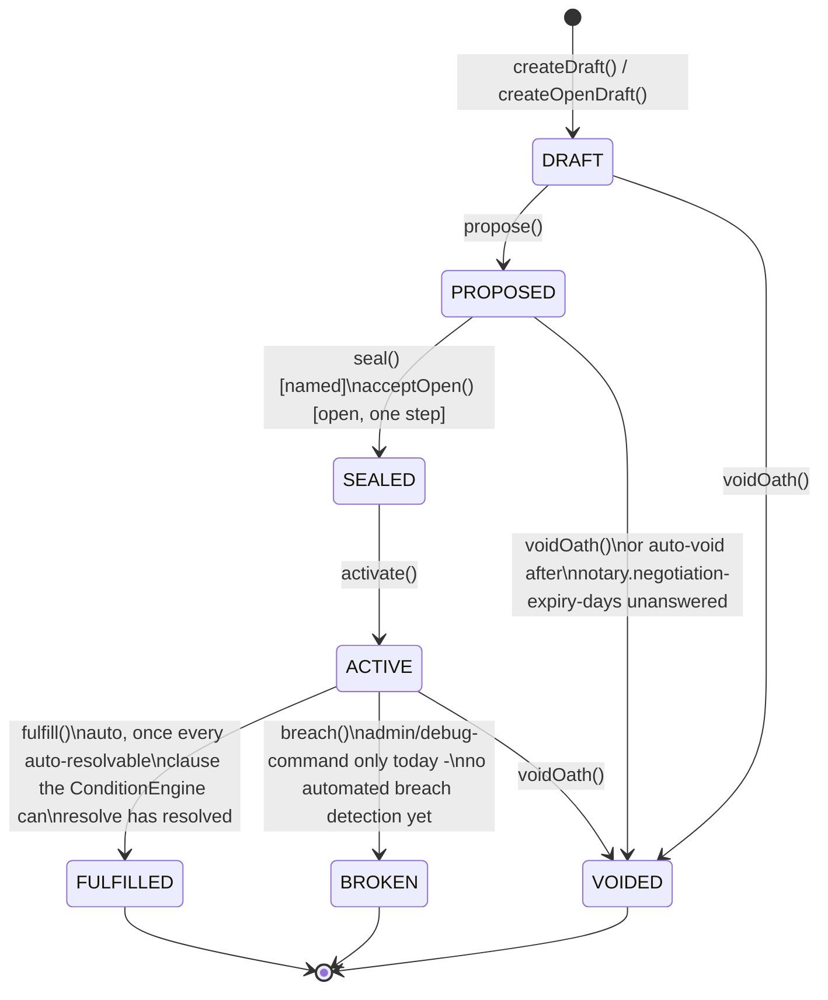

# Oath Lifecycle

Every Oath - a trade, a treaty, a ceremony, a named-party deal built at a Notary - moves through the
same state machine, enforced by `OathService` (`OathService.TRANSITIONS`) and recorded transition-by-
transition in the append-only **Ledger**. Paste the diagram below into
[mermaid.live](https://mermaid.live) to view/export it.

## Notes

- **Terminal states have no further transitions** - `FULFILLED`, `BROKEN`, and `VOIDED` are dead ends
  in `OathService.TRANSITIONS`.
- **Open oaths** (the trade board) skip the named-counterparty handshake: `acceptOpen()` carries
  `PROPOSED → SEALED → ACTIVE` in one call the instant someone claims the listing.
- **Ceremony-drafted oaths** (see [Ceremony Designer](ceremony.md)) also collapse the whole
  `DRAFT → PROPOSED → SEALED → ACTIVE` chain into one call, since both parties already consented
  through the ceremony's chat confirm/decline exchange - there's no separate propose-then-wait step.
- **Every transition is a `LedgerEntry`.** `HonorLedgerListener` reacts to `FULFILLED`/`BROKEN` entries
  to move Honor (see [Honor Scoring](honor.md)); `OathBoardEligibility` reacts to `SEALED`/
  `FULFILLED`/`BROKEN` entries on *witnessed* oaths to decide what posts to an Oath Board (see
  [Named-Party Oath Negotiation & Public Oath Board](notary-oath-board.md)). `VOIDED` never triggers either - it's treated as a
  neutral, mutually-agreed cancellation.
- **Known limitation:** the domain model has no fault-attribution concept - `BROKEN` just records
  *that* an oath broke, not *whose fault* it was, so Honor loss on breach currently applies to every
  party equally.

## Update this diagram when touching

`Oath.java`, `OathState.java`, `OathService.java`, `Ledger.java`/`LedgerEntry.java`,
`NegotiationExpiryService.java`.
