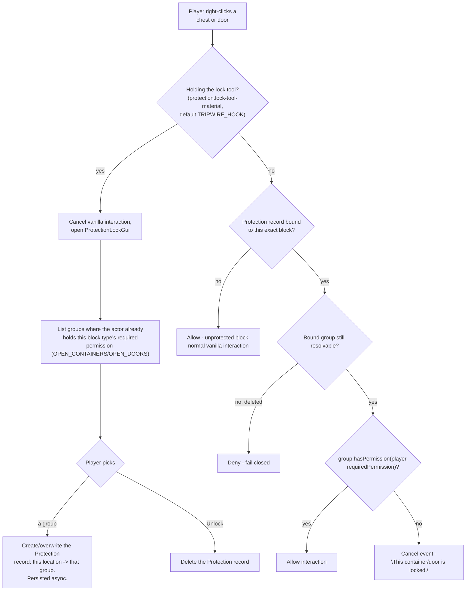
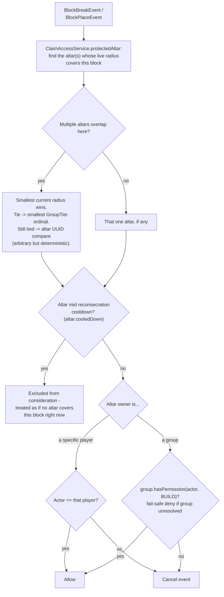

# Permissions & Access Gating

How a locked chest/door decides who gets in, and how block break/place is gated inside an altar's live
claim radius. Both ultimately bottom out in `ProtectionGroup.hasPermission`
(see [Groups & Ownership](groups-ownership.md)). Paste into [mermaid.live](https://mermaid.live).

## Chest / door locking and access

Doors normalize the top/bottom half to one canonical location before lookup, so locking either half
locks the whole door.

## Altar build gating (block break/place inside a claim)

New-altar placement legality (a one-time check at consecration, not ongoing) lives in
[Altars](altar.md) since it's part of the consecration flow, not everyday access gating.

## Notes

- `ClaimAccessService` reuses `AltarRadiusCalculator` rather than a second territory system - claim
  radius and build-gating radius are always the exact same live number.
- Because both radius and cooldown are live-computed, no periodic sweep is needed to keep access
  decisions correct - every check reads current truth.
- **Known gap:** no in-game command/GUI exists yet to view *why* a build was denied beyond the chat
  message - a player has to reason about which altar/group is involved themselves.

## Update this diagram when touching

`protection/ProtectionType.java`, `protection/Protection.java`, `protection/ProtectionAccessService.java`,
`listener/ProtectionLockListener.java`, `gui/ProtectionLockGui.java`,
`altar/ClaimAccessService.java`, `altar/AltarRadiusCalculator.java`, `listener/ClaimBuildGuardListener.java`.
