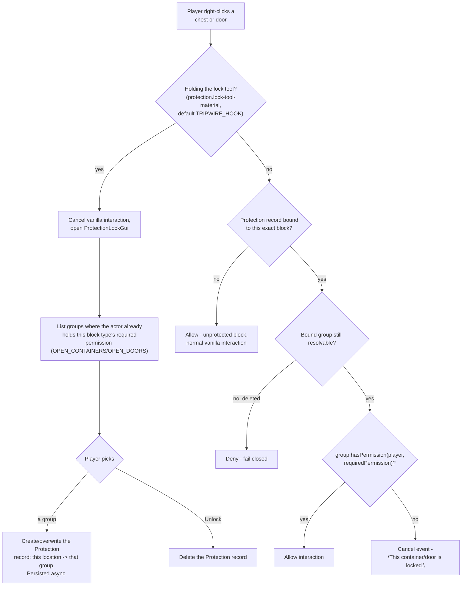

# Permissions & Access Gating

How a locked chest/door decides who gets in - the plugin's only remaining block-level protection
mechanic (area/region-level protection is left to a dedicated plugin, e.g. WorldGuard - see
[WorldGuard Integration](worldguard-integration.md)). Bottoms out in `ProtectionGroup.hasPermission`
(see [Groups & Ownership](groups-ownership.md)). Paste into [mermaid.live](https://mermaid.live).

## Chest / door locking and access

Doors normalize the top/bottom half to one canonical location before lookup, so locking either half
locks the whole door.

## Notes

- This is deliberately block-level only - a different granularity than a region-protection plugin like
  WorldGuard, so the two are complementary rather than redundant. Use both, or swap this out for a
  dedicated lock plugin (e.g. LWC) if you'd rather not maintain two systems.

## Update this diagram when touching

`protection/ProtectionType.java`, `protection/Protection.java`, `protection/ProtectionAccessService.java`,
`listener/ProtectionLockListener.java`, `gui/ProtectionLockGui.java`.
