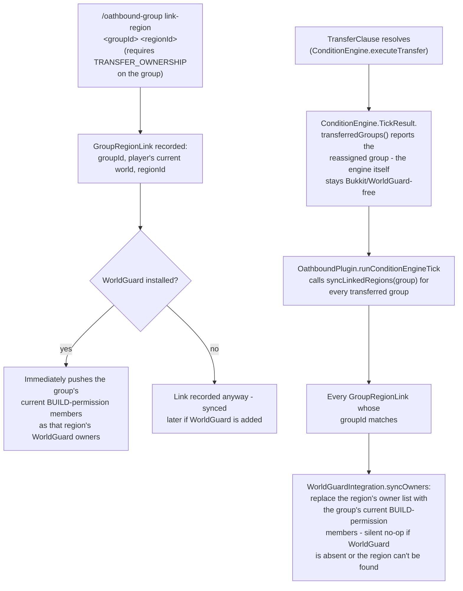

# WorldGuard Integration

Oathbound doesn't implement its own area-claiming/territory-protection system - that's WorldGuard's job,
and it does arbitrary-region (cube) protection better than a bespoke reimplementation would. What
Oathbound adds is a thin sync bridge: a `ProtectionGroup` can be linked to one or more WorldGuard
regions, and whenever the group's owner changes via a `TransferClause` (the AWOL-owner/heir succession
case), the linked region's WorldGuard owner list is automatically re-pushed to match - no separate manual
step. Entirely optional; a `softdepend`, not a hard dependency - Oathbound loads and runs fine with
WorldGuard absent, and every integration call is a no-op in that case. Paste into
[mermaid.live](https://mermaid.live).

## Why `BUILD`, and why owners not members

A linked region's WorldGuard *owner* list is synced to whichever of the group's members hold Oathbound's
own `GroupPermission.BUILD` - the same permission that already gates in-Oathbound build access anywhere
else in the plugin. This is a **documented convention, not an enforced one**: WorldGuard's own region
flags remain the actual gate on what happens inside the region (`build`, `pvp`, etc.) - Oathbound only
keeps *who counts as a member* in sync, so an admin composing flags around WorldGuard's owner/member
groups gets a source of truth that already matches Oathbound's own permission model instead of a second,
manually-maintained list.

## Notes

- **One-directional sync, Oathbound → WorldGuard only.** Changing a region's owners directly in WorldGuard
  doesn't feed back into Oathbound's group membership - the link exists to keep WorldGuard honest about
  Oathbound ownership changes, not to mirror WorldGuard state into Oathbound.
- **A group can hold multiple links** (e.g. a Kingdom with several separately-claimed regions) - each
  `GroupRegionLink` is its own row, looked up by scanning for a matching `groupId`, the same in-memory
  cache + linear-scan pattern every other domain object in this plugin uses rather than an indexed query.
- **Sync happens only on `TransferClause` resolution today** - membership changes that aren't an ownership
  transfer (there's no invite/kick command yet - see [Groups & Ownership](groups-ownership.md)'s own
  "Known gap") don't currently trigger a re-sync. Re-running `/oathbound-group link-region` with the same
  arguments re-syncs immediately as a manual workaround.
- **Complementary to, not a replacement for, the built-in chest/door lock-tool system**
  ([Permissions & Access Gating](permissions-access.md)) - WorldGuard protects arbitrary regions (cubes);
  the lock-tool protects individual blocks. Use both, or swap the lock-tool for a dedicated block-lock
  plugin like LWC if you'd rather not maintain two systems.
- **Setup dependency:** you still create and shape the WorldGuard region yourself (`/rg define`, etc.) -
  `link-region` only records the association and starts syncing owners; it doesn't create regions.

## Update this diagram when touching

`worldguard/WorldGuardIntegration.java`, `worldguard/GroupRegionLink.java`,
`command/OathboundGroupCommand.java` (`linkRegion`), `oath/ConditionEngine.java`
(`TickResult.transferredGroups`, `executeTransfer`), `OathboundPlugin.java` (`syncLinkedRegions`),
`persistence/DataStore.java`/`SqliteDataStore.java` (`*GroupRegionLink*` methods),
`db/migrations/0015_group_region_links.sql`.
